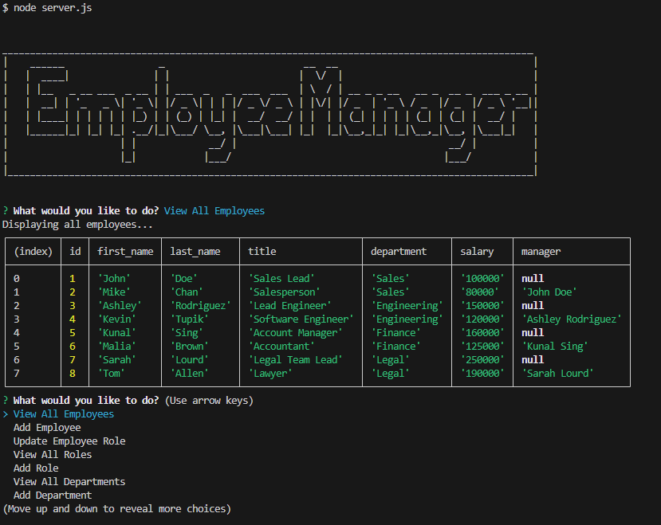

# PostgreSQL Employee Tracker

## Purpose

This is a simple application to view and update an employee database. The application uses Express.js, Inquirer, and PostgreSQL. The app uses the pg package to connect to the PostgreSQL database.

## Installation

Begin by initializing the node package module by typing "npm i" into the console. Once the dependencies are installed, log into postgres in the console and run the schema.sql and seeds.sql to create and populate the tables.

## Walkthrough Video

View the walkthrough video at this link: [Walkthrough Video](https://drive.google.com/file/d/1iRHXMeX_oJzFc6bIC6NGRvdXtPSj8sB8/view)

## Instructions

The user runs the application by typing "node server.js" into the console.

Using the prompts, the user can view and add departments, roles and employees. The user can also update an employee's role. 

## Screenshot

## Contact Me

Feel free to reach out to me if you have any questions, suggestions, or collaboration opportunities.

- **Email**: ccbabb@gmail.com
- **GitHub**: https://github.com/Babbalicious

## License

This project is licensed under the [MIT License](https://opensource.org/licenses/MIT).

